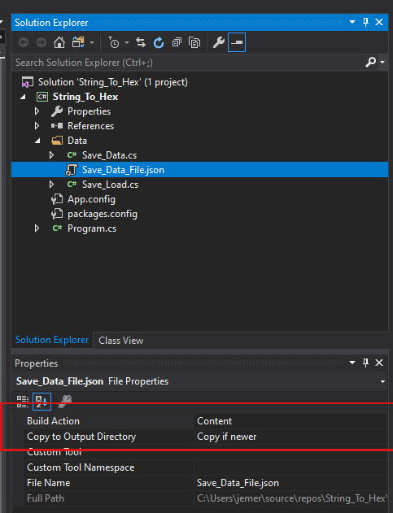

# Simple Save System: Monogame


This is a simple little Save/Load class I wrote for my Monogame projects. The class can save and load your data into either .json or hex string. **This project is a console app. You will need to bring the Save_Load.cs file into your monogame project.** The Save_Load.cs requires Newtonsoft.json, you can find it as a Nuget package.

https://www.nuget.org/packages/Newtonsoft.Json/


## Setting Up: 

First you will need a class that you want to save. A dummy save class has been provided in this reop(Save_Data.cs) 

Next you will need a .json file to save the data to(Save_Data_File.json) 

If using Visual Studio select the .json file and, make sure to set the Build Action = Content, and Copy to Output Directory = Copy if newer in the Properties tab. 



And finally you will need the path to the .json file (include file name and extension)


## Code: 

Create a new instance of the Save_Load class. It will need a type, the path to the save file, and a bool. I recomend setting the bool flag to false while building your game. So you can ensure all data is getting saved correctly. 

```csharp
//true = save as a hex string
//false = save a a json string
Save_Load<Save_Data> saveLoad = new Save_Load<Save_Data>(savePath, true); 
```

Next we will need the "Data" class that we want to save

```csharp
Save_Data data = new Save_Data("Super Hero Guy", 150f, 205f, 10f, 12f, 8f, 14);
```

To save the data simple call the Save(), and pass in the data you want saved

```csharp
saveLoad.Save(data);
```

To load the data from file call the Load(). which returns a type T.

```csharp
Save_Data loadedData = saveLoad.Load();
```

From there use `loadedData` as you see fit.

```cshart
//example
player.Health = loadedData.health;
player.weapon = loadedData.weaponID;
```


 
